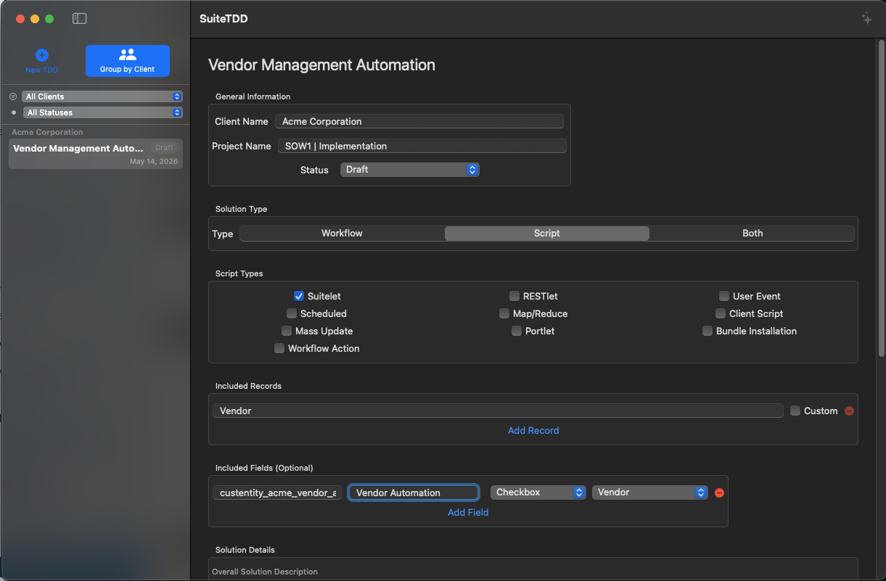
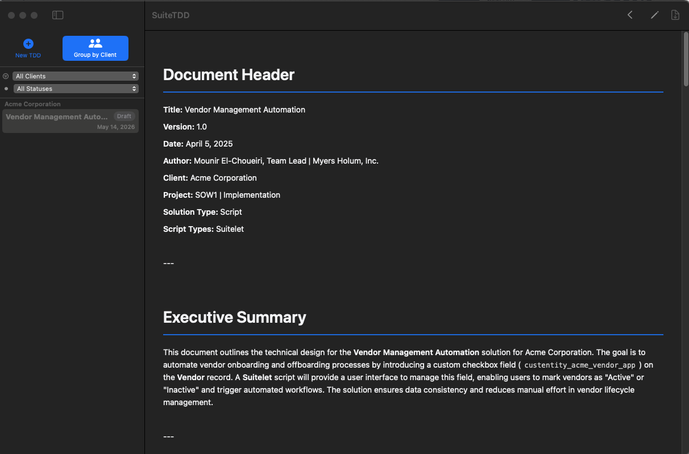
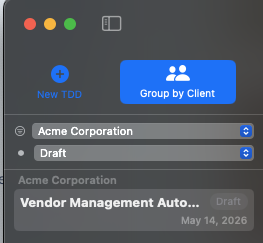
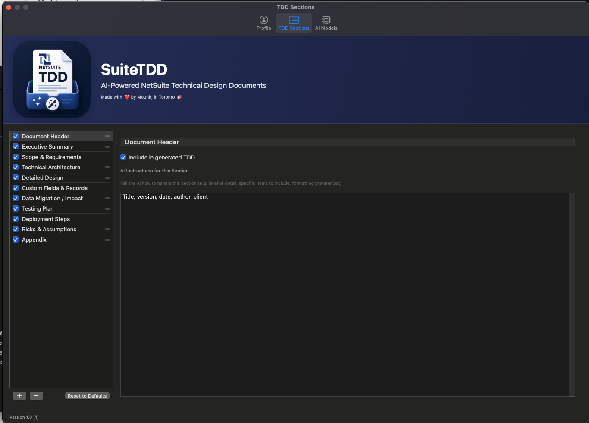
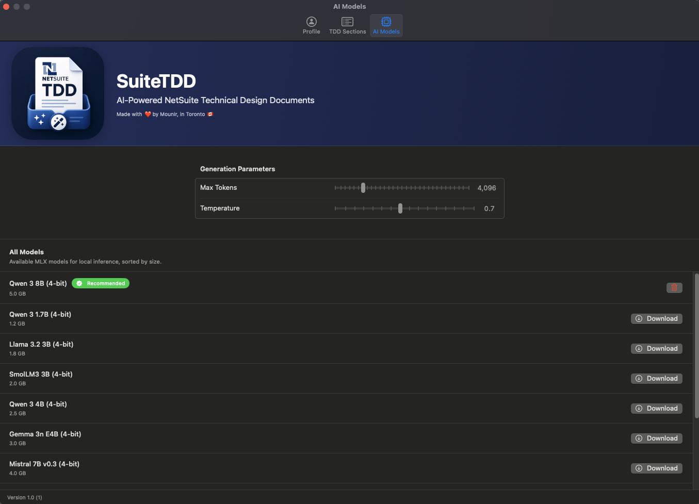
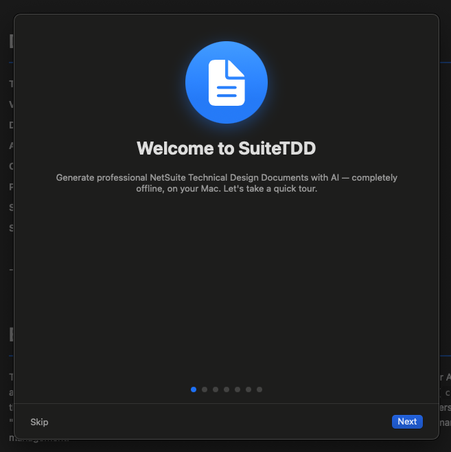

# SuiteTDD

**AI-Powered NetSuite Technical Design Documents — generated locally on your Mac.**

SuiteTDD is a native macOS app that helps NetSuite consultants and developers produce professional Technical Design Documents (TDDs) in seconds. It runs entirely offline using Apple Silicon's MLX framework — your client data never leaves your Mac.

> Made with ❤️ by Mounir, in Toronto 🇨🇦

---

## Features

### 🧠 Local AI Generation
- Runs 100% offline using Apple's MLX framework on Apple Silicon

### 📄 Structured Document Authoring
- Capture everything a TDD needs: client, SOW #, project name, TDD title, solution type, script types, included records, included fields, integration points, testing criteria, risks & assumptions
- Live status workflow per document: **Draft → Client Review → Client Approved → Cancelled**

### 🗂️ Multi-Document Workspace
- Sidebar lists every TDD you've created with color-coded status badges
- Filter by **Client** or **Status** with per-status document counts
- Toggle **Group by Client** for a folder-style view

### ✨ Smart Prompt Engineering
- Customize **TDD Sections** — choose which sections appear, reorder them, write per-section AI instructions and sample text
- Per-section placeholders: `{company}`, `{author}`, `{authorRole}`, `{client}`, `{project}`, `{title}`, `{sow}`, `{date}`
- Global tone/style and "additional instructions" applied to every generation

### 🎨 Style System
- **Multi-profile styles** — create, duplicate, rename, delete, and set a default style profile
- **PDF style import** — drop a branded PDF and SuiteTDD extracts fonts, sizes, colors, margins, heading styles, and logos automatically

### 📝 Live Markdown Preview & Editor
- Inline markdown editor — tweak generated content before exporting
- Web view preview with dark-mode-aware syntax highlighting
- Properly formatted tables, code blocks, and headings

### 📤 Word Export
- One-click export to `.docx` with native macOS save dialog
- **Export filename template** with `{title}`, `{client}`, `{project}`, `{sow}`, `{date}` placeholders
- **Auto status bump** — exporting a Draft automatically transitions it to Client Review (configurable)

### 🔐 Licensing & Free Trial
- **7-day free trial** with full access — no credit card required
- Purchase a lifetime license via Stripe — key delivered by email instantly
- Activate on up to 2 machines per license

### ⌨️ Keyboard Shortcuts
- **⌘N** — New TDD
- **⌘⇧G** — Generate
- **⌘P** — Toggle Preview
- **⌘E** — Export to Word

### 🚀 Onboarding & Auto-Update
- First-launch tutorial walks new users through profile setup, model download, feature overview, and trial activation
- Built-in **auto-update** from GitHub Releases — checks daily, downloads DMG, mounts, replaces, and relaunches
- Tutorial re-playable anytime from **Settings → General**

---

## Requirements

- macOS 14.0 (Sonoma) or later
- Apple Silicon Mac (M1, M2, M3, or newer) — MLX requires Apple Silicon
- ~5 GB of free disk space per AI model

---

## Installation

1. Download `SuiteTDD-v2.0.zip` from the [latest release](../../releases/latest)
2. Unzip and drag **SuiteTDD.app** into your Applications folder
3. Launch SuiteTDD — it's signed and notarized by Apple, so it opens without any security warnings
4. Follow the in-app tutorial to set up your profile, download an AI model, and start your free trial

---

## Screenshots

<!-- Drop screenshots into docs/screenshots/ and they'll render below -->

| Document Editor | Generated Output |
| --- | --- |
|  |  |

| Sidebar with Filters | Settings & TDD Sections |
| --- | --- |
|  |  |

| AI Models Manager | First-Launch Tutorial |
| --- | --- |
|  |  |

---

## Roadmap

- [ ] Template library for common NetSuite customization patterns
- [ ] Email license keys automatically via Resend after Stripe purchase
- [ ] Anything else you can think of and want to request!

---

## License

Copyright © 2026 Mounir El Choueiri. All rights reserved.

SuiteTDD requires a license for continued use after the 7-day free trial. Purchase a license at the in-app "Buy Now" link or from [our website](https://buy.stripe.com/8x200j8IU0d994E2oubwk00).
